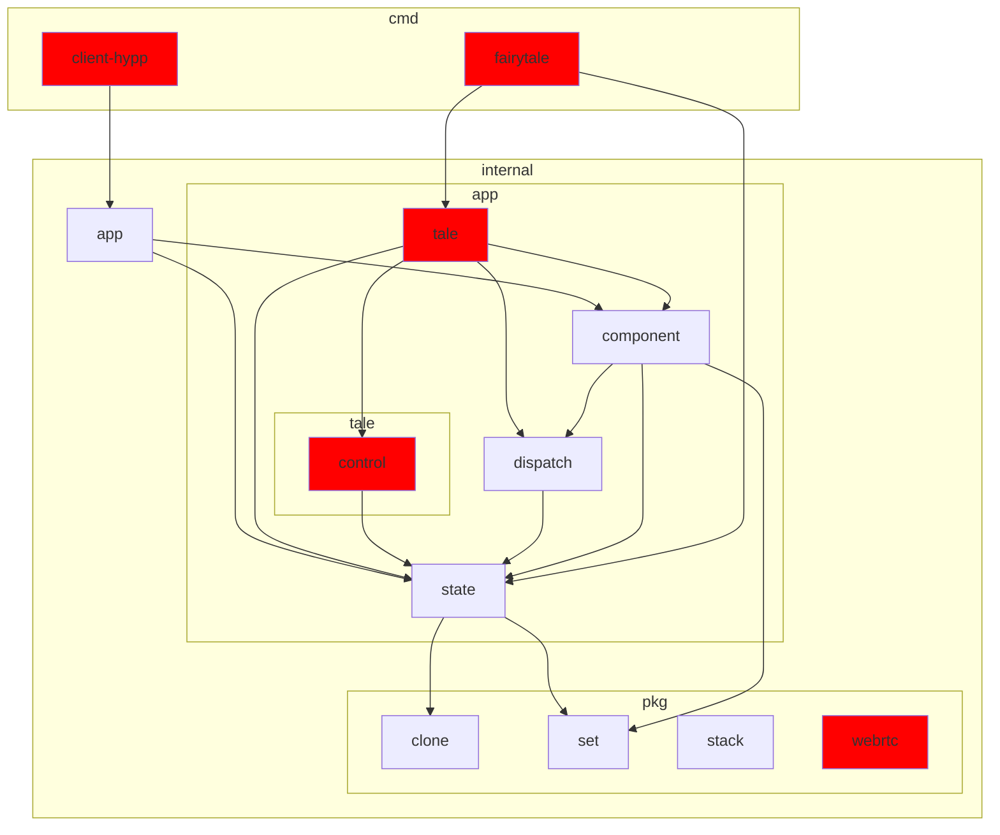

# senet

## Setup

The setup requires 3 terminals.

### Terminal 1

Install [air](https://github.com/cosmtrek/air) and run it in the root directory:

```shell
air
```

`air` will watch the Go files and rebuild the fairytale WASM file whenever you make any changes.

### Terminal 2

Install [sass](https://sass-lang.com/) and run it in the root directory:

```shell
sass --watch cmd/client-hypp/scss:cmd/client-hypp/public
```

`sass` will watch the scss files and recompile the css file whenever you make any changes.

### Terminal 3

Install the [fairytale cli](https://github.com/macabot/fairytale#cli) and run it in the root directory:

```shell
fairytale serve :8000 cmd/fairytale/main.wasm --watch --assets cmd/client-hypp/public
```

`fairytale` will watch the WASM file and assets. Whenever any changes are made it will reload the web page.
You can visit the fairytale app on http://localhost:8000/.

## Test

```sh
go test $(go list ./... | grep -vE 'cmd|tale|webrtc')
```

## Build

```sh
./cmd/client-hypp/build
```

## Development

### Package dependency tree

Red nodes directly or indirectly import `syscall/js`.


