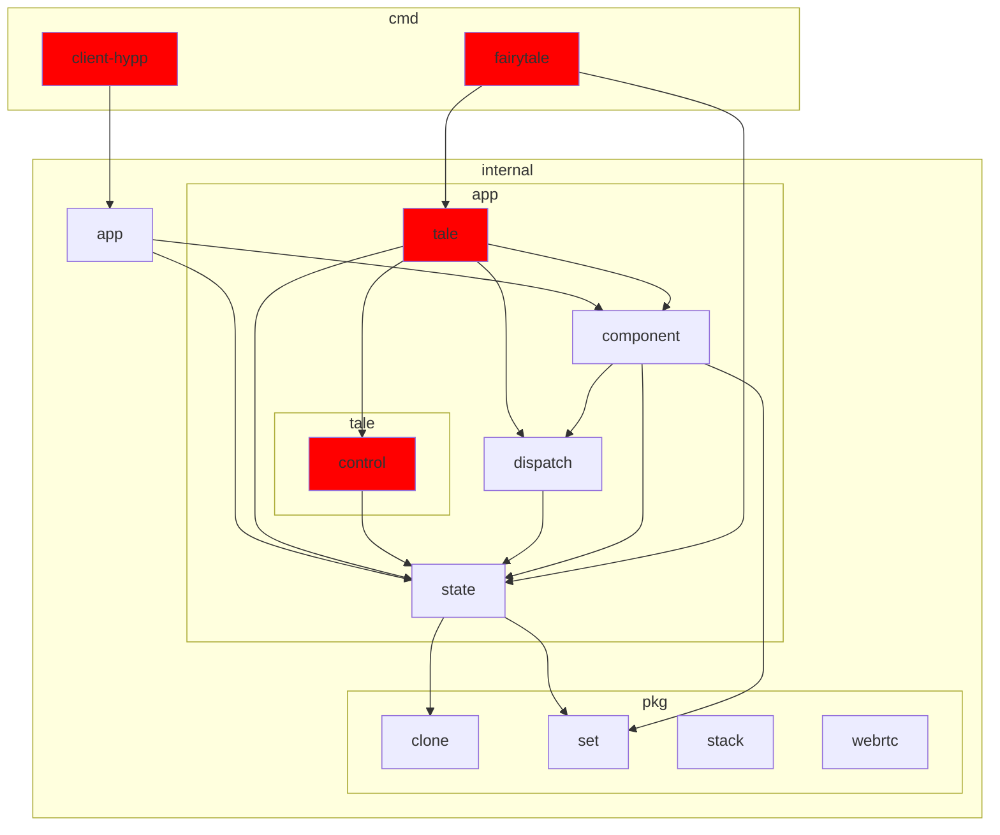
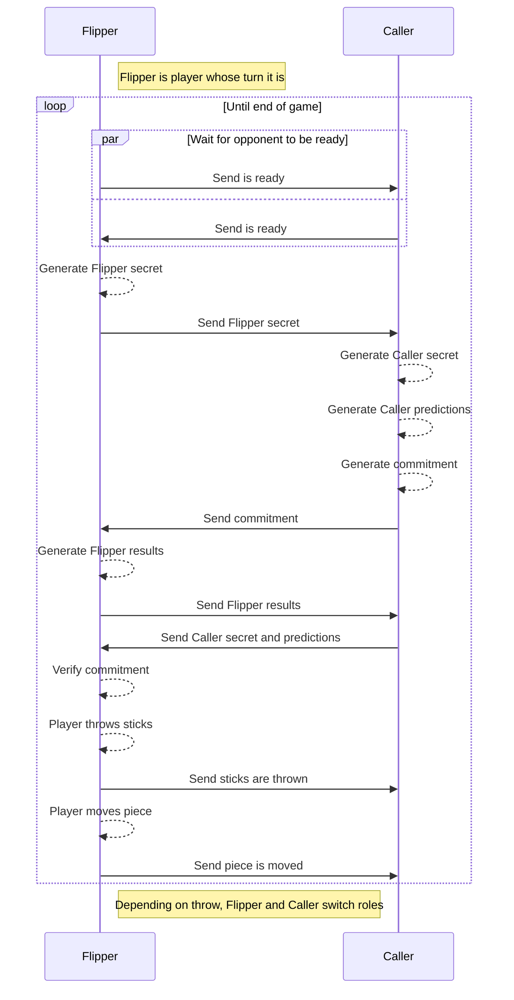

# senet

## Setup

The setup requires 3 terminals.

### Terminal 1

Install [air](https://github.com/cosmtrek/air) and run it in the root directory:

```shell
air
```

`air` will watch the Go files and rebuild the fairytale WASM file whenever you make any changes.

### Terminal 2

Install [sass](https://sass-lang.com/) and run it in the root directory:

```shell
sass --watch cmd/client-hypp/scss:cmd/client-hypp/public
```

`sass` will watch the scss files and recompile the css file whenever you make any changes.

### Terminal 3

Install the [fairytale cli](https://github.com/macabot/fairytale#cli) and run it in the root directory:

```shell
fairytale serve :8000 cmd/fairytale/main.wasm --watch --assets cmd/client-hypp/public
```

`fairytale` will watch the WASM file and assets. Whenever any changes are made it will reload the web page.
You can visit the fairytale app on http://localhost:8000/.

## Test

```sh
go test $(go list ./... 2>/dev/null | grep -vE 'cmd|tale')
```

## Build

```sh
./cmd/client-hypp/build
```

## Development

### Package dependency tree

Red nodes directly or indirectly import `syscall/js`.



## Online player vs players

When playing an online game, two players use [WebRTC](https://developer.mozilla.org/en-US/docs/Web/API/WebRTC_API) to connect directly to one another.
This means there is no trusted third party to generate a random throw of the sticks.
Instead a [commitment scheme](https://en.wikipedia.org/wiki/Coin_flipping#Telecommunications) is used:



The throw of the sticks is based on the [NXOR](https://en.wikipedia.org/wiki/XNOR_gate) operation on every prediction and result pair.
E.g.
| Caller predictions | Flipper results | Throw flips |
| ------------------ | --------------- | ----------- |
| 1 | 1 | 1 |
| 0 | 1 | 0 |
| 0 | 1 | 0 |
| 0 | 0 | 1 |
| | Throw | 2 |
