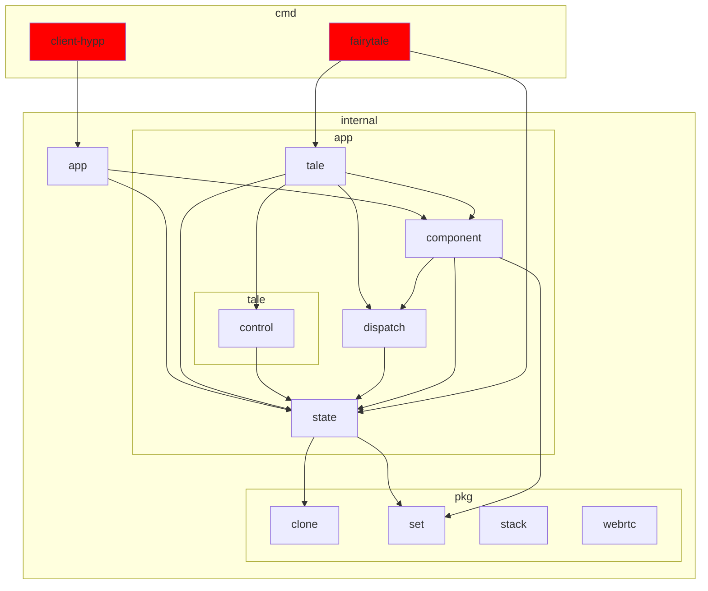
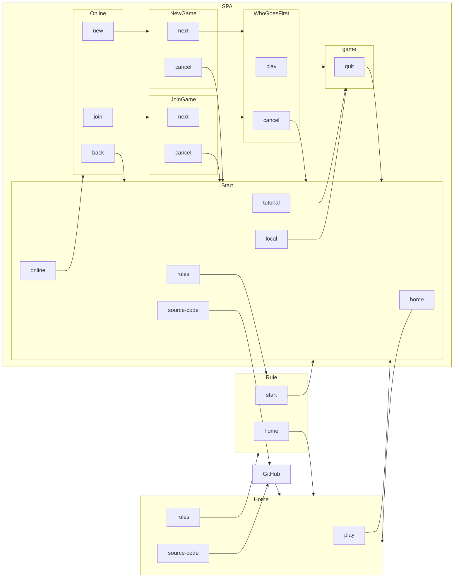
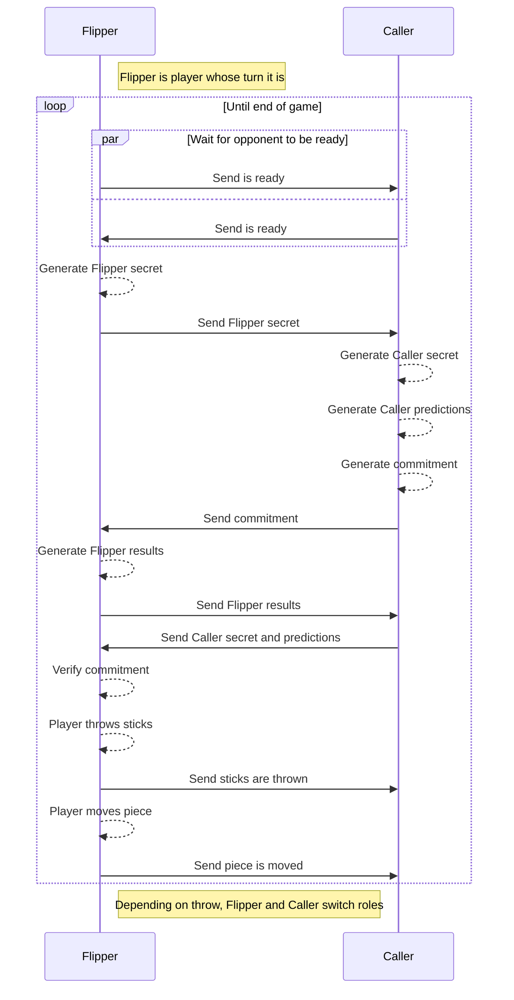

# senet

Play at <https://senet.macabot.com>.

## Dependencies

- [Go](https://go.dev/)
- [Sass](https://sass-lang.com/)
- [Air](https://github.com/cosmtrek/air)
- [Fairytale cli](https://github.com/macabot/fairytale#cli)
- [Brotli](https://github.com/google/brotli)
- [wasm-opt](https://github.com/WebAssembly/binaryen)

## Setup

The setup requires the following terminals.

### Terminal 1

Run `air` in the root directory:

```shell
air
```

`air` will watch the files and run the [build script](#build) whenever you make any changes.

### Terminal 2

Run the fairytale cli in the root directory:

```shell
fairytale serve :8000 cmd/fairytale/main.wasm --watch --assets public
```

`fairytale` will watch the WASM file and assets. Whenever any changes are made it will reload the web page.
You can visit the fairytale app on <http://localhost:8000/>.

### Terminal 3

Run the static file server

```shell
go run cmd/server/main.go -d ./public
```

You can visit the Senet app on <http://localhost:8001/>.

## Test

```sh
go test $(GOOS=js GOARCH=wasm go list ./... | grep -v 'cmd')
```

```sh
docker run --rm \
    -v "$(pwd)":/workspace \
    -v "$HOME/go/pkg/mod":/go/pkg/mod \
    -v "$HOME/.cache/go-build":/root/.cache/go-build \
    -w /workspace \
    macabot/senet-builder:0.2.0 go test $(GOOS=js GOARCH=wasm go list ./... | grep -v 'cmd')
```

## Build

Run the build script as follows:

```sh
./build $environment [$public_dir]
```

The `$environment` must be either 'development' or 'production'.
The `$public_dir` is optional and defaults to './public'.

Alternatively, you may use the Docker `senet-builder` container:

```sh
docker run --rm \
    -v "$(pwd)":/workspace \
    -v "$HOME/go/pkg/mod":/go/pkg/mod \
    -v "$HOME/.cache/go-build":/root/.cache/go-build \
    -w /workspace \
    macabot/senet-builder:0.2.0 ./build development
```

## Development

### Creating a new Docker image

Build the Docker image:

```sh
docker build -t macabot/senet-builder:$tag .
```

Push the Docker image to the registry:

```sh
docker push macabot/senet-builder:$tag
```

See <https://hub.docker.com/r/macabot/senet-builder>.

### Package dependency tree

Red nodes directly or indirectly import `syscall/js`.



## Page navigation



## Online player vs players

When playing an online game, two players use [WebRTC](https://developer.mozilla.org/en-US/docs/Web/API/WebRTC_API) to connect directly to one another.
This means there is no trusted third party to generate a random throw of the sticks.
Instead a [commitment scheme](https://en.wikipedia.org/wiki/Coin_flipping#Telecommunications) is used:



The throw of the sticks is based on the [XNOR](https://en.wikipedia.org/wiki/XNOR_gate) operation on every prediction and result pair.
E.g.
| Caller predictions | Flipper results | Throw flips |
| ------------------ | --------------- | ----------- |
| 1 | 1 | 1 |
| 0 | 1 | 0 |
| 0 | 1 | 0 |
| 0 | 0 | 1 |
| | Throw | 2 |
